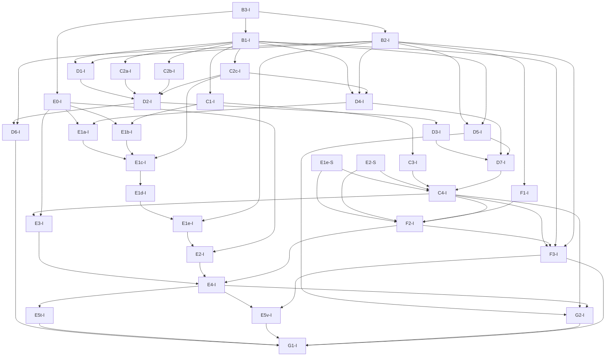

# DeepSeek-V4.1-Flash: Phase B–G implementation plan v4

This plan supersedes the v3 Phase B–G plan. It specifies future implementation
and acceptance work; it does not certify a runnable model or training parity.
Paths below are relative to `experimental/lite/`. New paths are planned artifacts.

## 0. Evidence, scope, and corrected premise

The current scope is post-training only. The decision ledger and
`deepseek_v41_a8_evidence.md` supersede historical OPEN summaries and pretraining
schedule requirements below. `deepseek_v41_tasks.json` / `deepseek_v41_tasks.md`
provide the 64 individually scoped, dependency-ordered work items.


Consume A1 `docs/deepseek_v41_owner_consumer.md`, A2
`docs/contracts/deepseek_v41/{README.md,weights.json,config.json}`, A3
`docs/specs/deepseek_v41_csa2.md`, and A4
`docs/specs/deepseek_v41_optimizer.md`. The specification snapshot is
`1c4df34a5c53ed43d3fde36873ad5c4a671ee884`; the required A1/A3 correction is
`9d1697a2883bd93045fde84aaa8b325444f93b63`. Consume corrected files, never the
uncorrected snapshot's CED denial. The A1 file shipped alongside this revision
supersedes 9d1697a28's remaining differentiable-integer arrows.
This revision carries corrected A1 and its CED validator; A2–A4 remain prerequisite specifications.
Specification checks, workflow completion, mainline ancestry, and a proposed PR
are four different facts. No mainline merge is asserted here.

The official source is the local audited snapshot of
`deepseek-ai/DeepSeek-V4.1-Flash` at `df42c109f1defefcbfcedbe7d905718a12266e40`.
`inference/model.py` SHA-256 is
`4e9ae23620edc8028ccc5d5fef552ab7fdc7dcd6f79608754fe9f67644056f65`.
A1–A4 provide source/report citations; this plan makes no latest-release claim.

Official inference **does have decoder cross-layer global-KV dependencies**:

```text
h20, p20 = Block(19)(...)  # returned residual and paired pre_mix
x20 = attn_norm_20(hc_pre(h20, p20))
latent20 = compressor_norm_20(compressor_wkv_20(x20))  # ratio=1
index_k20 = k_norm_20(wk_20(latent20))                  # pre-main-RoPE latent
main_kv20 = official_main_rope_then_phase_quantization(latent20)
# layers 21..39 consume main_kv20; each layer computes its own SWA KV
```

Naming `(h20,p20)` makes the existing boundary explicit. Raw h20 has an HC axis
and cannot bypass p20, pre-mix, or normalization. D1/D2 own this work; there is
no D8 package and no new decoder projection. B1 must compare x20, latent20,
main_kv20, index_k20 and every consumer output; B2 separately checks backward.
Deployment prefill skipping and bounded SWA replay are outside this training port.
DSpark execution and rollout generation are also excluded; MTP storage is retained.

Phase A confirmed removal of the extra Q head RMS for V4.1 and compressed RoPE
for every nonzero ratio. These were already directions in v2, not reversals of
v2. Locate the inline RMS operation by semantics, not a stale helper name/line.
The float64 reduced grouped-projection fixture's zero error proves that fixture
and supports the algebra; it does not certify GPU/dtype/kernel bitwise parity.
Do not infer the historical purpose of DS4 fusion or change DS4 semantics.

## 1. Gate conventions and implementation steps

Every package below has a real `-S` specification gate and `-I` implementation
gate. An S gate cites existing A decisions, records only new interface/precision
choices, and supplies independent expected fixtures. It does not reopen settled
A manifests. An I gate executes the actual implementation against those fixtures.
Source-string presence, accepted config values, and rerunning a schema validator
are insufficient implementation evidence. Deferred integration gates are named.

For each implementation package, take 2–5 minute steps: (1) inspect its named
source and reference, (2) add the smallest discriminating test at the named test
path and run it red, (3) implement the named operation, (4) run the focused test
and mutation, then record output/exit code. Repeat by operation rather than
estimating an entire distributed feature as a five-minute task.
Test files in the tables are under `tests/unit/deepseek_v41/` unless stated.
The exact CPU command for a named test is
`python -m pytest experimental/lite/tests/unit/deepseek_v41/<file> -q`.
GPU/distributed tests go through Slurm; record deployed file digests, job IDs,
`sacct` exit status, non-skip counts, errors, and thresholds. A CPU gate cannot
close a distributed or full-size gate. Numeric tolerances must be derived and
reviewed in S before accepting I; unresolved tolerances block that comparison.

### B: independent references and fixtures

| S gate | I gate and concrete artifact | Execution gate | Deferred gate |
|---|---|---|---|
| B3-S: fixture dimensions, weights, position/margin/tie rules from A1–A4 | B3-I: `tests/fixtures/deepseek_v41/manifest.json` and generator; retain 40-layer ownership, all three CSA2 modes, both Engrams, CED boundary, nonaligned packed/image spans | `test_fixtures.py`: check generated shapes, owner identities, reproducibility and hand-known sentinels | G1 actual dimensions and weights; never label a reduced fixture full-model parity |
| B1-S: official wrapper input/output and instrumentation contract | B1-I: `tools/deepseek_v41/oracle.py`; build official ModelArgs and converted shards from B3, execute original methods, expose all-token head output and named CED intermediates | `test_oracle.py`: independent official execution comparison, complete weight/token coverage, deterministic seeds; use A5 AST-extracted executable dataflow probes, including their eleven mutations | G1 full-size official generation/forward comparison |
| B2-S: independent report-derived differentiable equations, objectives and update vectors; list unknown training choices | B2-I: `tests/reference/deepseek_v41/training.py`; scalar/float64 reference independent of native kernels | `test_training_reference.py`: analytical versus finite-difference checks where smooth, detach and sum-of-consumer checks; discrete selections held fixed | D/F native backward/update; unknown official objectives remain blocked |

B3 precedes runnable B1. Wrapper scaffolding may be written earlier but is not
B1-I acceptance. Official inference-mode code establishes forward, not training
gradients. B2 may validate explicitly approved port choices; it cannot relabel
unknown training recipes as official.

### C: payload, quantization, and model assembly

| S gate | I gate and concrete artifact | Execution gate | Deferred gate |
|---|---|---|---|
| C1-S: A2 header/payload/decode contract | C1-I: `model/deepseek_v41/lite/checkpoint.py` FP4 packed I8 and FP8 block [32,32] decoding | `test_checkpoint_decode.py`: independent official decode, known code values and loaded GEMM; separate raw-byte roundtrip including header dtype/shape/digest | C4 full binding; G1 actual shards |
| C2a-S: A3 main KV E2M1, group16/E4M3, no second global scale, post-RoPE, post-training only | C2a-I: `primitive/quantization/ds41_kv.py` | `test_kv_quantization.py`: codes/scales, rounding/ties, zero, saturation, dequantized values and separately approved fake-quant derivative | D2 sparse ABI and G1 phase transition |
| C2b-S: A3 index Q/K E2M1 group32/E8M0, independent QAT switch | C2b-I: `primitive/quantization/ds41_index.py` | `test_index_quantization.py`: the same distinct format-level checks plus input gradients; main-KV off must not disable index QAT | D2/D6 |
| C2c-S: A3 SWA full-vector post-RoPE FP8 and Linear dynamic activation FP8, separate policies | C2c-I: `primitive/quantization/ds41_fp8.py` | `test_fp8_quantization.py`: official rounding/scale/saturation and actual Linear GEMM, input/weight derivatives under declared training policy | D2/D4 and G1; BF16 decode+GEMM alone is insufficient |
| C3-S: A2 inactive MTP carrier, original config, independent execution flag | C3-I: `model/deepseek_v41/lite/checkpoint_store.py`; 2401 MTP keys in file/CPU carrier and independent storage shards | `test_mtp_store.py`: load/save/repartition bytes identical; original dspark_block_size=5 accepted with enable_dspark_execution=False; execution request raises NotImplementedError | C4/G1; MTP excluded from trainable coverage but included in checkpoint coverage |
| C4-S: consume A1–A4, all 96085 keys and 87 config leaves; declare canonical owner/alias, header→logical weight binding and protocol contract | C4-I: `model/deepseek_v41/{config.py,__init__.py,lite/model.py,lite/protocol.py,lite/checkpoint.py,lite/vision.py}` plus `model/registry.py`; compose D modules, backbone, vision and aligner, preserve full module tree in text-only mode | `test_model_binding.py`: nested config reaches actual behavior, every key has a header/store/owner mapping, every active parameter is bound once; construct via registry and run protocol; forward/binding first; training export subgate after active decisions close: backbone changed, MTP bytes unchanged | F2 actual optimizer enumeration; E distributed binding and G1 real-size all-key load |

C4 is a real model-assembly and mapper package, not a renamed schema check.
Raw storage roundtrip, independently correct decoding/GEMM, and updated training
export are separate mandatory gates. Mutate a permutation and its inverse to
show roundtrip alone cannot certify decoding; mutate export to write only the
original store to show it cannot certify trained weights.

### D: single-device semantics

For each D-I compare actual inputs/outputs, input and parameter gradients,
detach boundaries, multiple-consumer sums, and one update where an optimizer is
required. B1 supplies forward and B2 supplies training equations. Distributed
PP/CP/recompute transport and restart are E gates, not D acceptance obligations.

| S gate | I gate and concrete artifact | Execution gate | Deferred gate |
|---|---|---|---|
| D1-S: corrected A1 shifted mHC and paired CED state | D1-I: `model/deepseek_v41/lite/block.py`; attention consumes pre_mix, FFN consumes attn_pre, return ffn_pre, initial/final contraction | `test_hc_boundary.py`: B1 real sublayer/CED values and B2 gradients; distinct residual copies and old/new coefficients make wrong contraction observable | E3 paired payload, recompute, PP |
| D2-S: corrected A1/A3 owner/mode/operator decisions and C formats | D2-I: `model/deepseek_v41/lite/attention.py`; explicit source state and CSA2 modes without extra decoder projection | `test_attention.py`: B1 CED intermediates and all consumer outputs using injected official candidate masks (no native builder claim), B2 floating KV gradient sums; ranking-reversal fixture crosses Top-K boundary; same-source replay is positive equivalence | E3/E4 state transport and kernel ABI; G1 |
| D3-S: A3 two-level candidate builder, post-training switch | D3-I: `model/deepseek_v41/lite/candidates.py` | `test_candidates.py`: independently compare layer20 pool membership then later Reindex selection; newest reachable block pinned, -inf blocks excluded, incomplete/empty tails handled, pool-outside winner from different later scores; mandatory native D2+D3 consumer integration parity after D3 | E4 CP positions |
| D4-S: official Engram hash and computation | D4-I: `model/deepseek_v41/lite/engram.py`; NFKC/accent removal/lowercase, odd multiplier with 10007*layer_id, prime buckets, token_mask excludes images, no short causal convolution; wkv and per-HC-copy RMS, signed-sqrt sigmoid gate | `test_engram.py`: known integer hashes plus B1 forward/B2 derivatives, perturb seed/offset/reset and reject specific wrong values | E1/E2 table training |
| D5-S: modality-specific load update reference, rate 0.001 and sequence auxiliary coefficient 0.0001; unresolved reduction scope stays explicit | D5-I: `model/deepseek_v41/lite/moe.py` and generic router capability extension in `primitive/modules/router.py` | `test_moe.py`: bias crosses selected/unselected boundary, unbiased gate weights stay correct; compare two bias updates' signs/values and empty-modality behavior | E4 cross-rank reduction/atomic step; E5 restart; G2 replay |
| D6-S: exact indexer objective, coefficient, normalization, detach, consumer contribution table; unknown choices block official training acceptance | D6-I: `model/deepseek_v41/lite/indexer_loss.py`; consume loss autoscaler through protocol | `test_indexer_loss.py`: independent objective value, input/parameter gradients and distinct multiple-consumer sums; reject wrong sign, coefficient, normalization, detach and omitted consumer | E3/E4 shared owner gradient delivery; G1 training |
| D7-S: A1/A3 packed sequence-local history and visibility | D7-I: `model/deepseek_v41/lite/packing.py`, protocol shared THD split helper | `test_packing.py`: independent versus packed with fixed weights/bias/RNG/loss normalization and isolated auxiliary statistics; backprop only B loss, perturb A, compare B output/input gradients/parameter contribution and integer hash/visibility | E4 real runtime full-THD→CP-local and non-skip gradient parity |

D6 distinguishes floating KV autograd, integer selection dependence, and the
auxiliary objective. Integer Top-K/masks have no ordinary derivative. Reuse has
no private indexer, but the shared indexer may receive auxiliary gradients from
its declared contributors. Neither “nonzero gradient” nor “Reuse gradient zero”
is an acceptance criterion. Global loss normalization remains OPEN (O16); DS4 parameter inheritance does not decide runtime objective weighting.
B2/D5/D6 must define each objective's numerator, denominator, token/sequence
weights, valid-token/image/padding masks, DP/CP reduction and accumulation scope,
and all scales already applied by the runtime. Derive the pre-forward hook value
from that contract, including DP averaging and existing runtime loss scale.
`1/num_microbatches` is valid only for an approved equal-microbatch objective or
when proven equivalent to the approved sample weighting; it is not a default.
Inactive MTP does not enable an MTP loss or unrelated auxiliary scaling.
Test the same valid sample set under unequal microbatch cuts, padding and CP
partitions: compare loss, gradients and updates. Reject duplicate scale, missing
valid tokens and averaging per-microbatch means when token weighting is required.
Counterexample: one valid token with gradient 0 and three with mean gradient 2
produce global token mean 1.5, versus equal-microbatch mean 1. These are different
objectives, even if each applies its scale exactly once.

### A3 decision-to-implementation coverage

Each row names the A3 operator rows it consumes and an executable test obligation.

| A3 decisions | Implementation | Fixture / actual comparison |
|---|---|---|
| Layout adapter; Q low rank; local KV | D2-I | token/head sentinels, norm epsilon, one latent head; `test_attention.py` |
| Q head RMS | D2-I | q=[2,0], identity K probability counterexample; DS4 behavior retained |
| RoPE branch, pair layout, scaling | D2-I | ratios 0/1/2, nonzero rotary channels and positions 1/127/128/65535/65536/1048575; compressed theta=160000 and YaRN for ratio!=0 |
| Compressor allocation; ratio2; ratio1 | D2-I | owners 2/8/14/20 only; ratio2 FP32 projections→per-feature softmax→cast→norm; ratio1 BF16 projection→norm without gate |
| Overlap; APE; compressed positions/visibility | D2-I/D3-I | remove overlap/doubled dimensions/APE, sequence-local j*ratio and floor((p+1)/ratio), invisible incomplete groups |
| Index K origin; Index Q transform | D2-I/C2b-I | pre-main-RoPE latent→wk→k_norm, shared K; no independent compressor or rotate_activation |
| Index score | D2-I/E4-I | ReLU head sum, 128^-1/2*32^-1/2 applied exactly once; TP sum versus independent dense score |
| Two-level candidates; Top-K sharing | D3-I/D2-I | block8, top2048 block maxima, newest reachable pin, top512 positions, sorted global offsets and -1 unreachable; test publisher and consumers |
| SWA/global concatenation; logits/sink | D2-I/C2c-I | local window128, owner global entries, mask/offset/sink and 512^-1/2 sparse ABI; do not deduplicate entries without evidence |
| Cache quantization | C2a-I/C2b-I/C2c-I | three distinct formats and switches, derivative policies and actual quantized kernel inputs |
| Inverse output RoPE; grouped projection | D2-I | inverse before projection, 8 groups→8192→5120, permutation mutation; CPU algebra does not certify fused GPU |
| State/backward/CP | D1-I/D2-I/D6-I/E3-I/E4-I | floating owner sums, discrete dependencies, explicit microbatch lifetime and CP reconstruction |

Run existing `test_csa_thd_cp.py`, `test_dsa_cp_native_unit.py`, and DS4 model
recompute/resync tests for shared changes. E4/G1 add matched DS4 GPU numeric and
performance regression runs, with baseline revision, dimensions, warmups and
reviewed regression budgets. V4.1 branches must not delete shared DS4 Q RMS or
change its RoPE policy.

### E: ownership, distributed data, and state

E1a–E1e require GPU-resident Engram table shards throughout post-training:
no CPU table offload or host/RDMA prefetch path. E1d prefetch routes GPU-owned
rows across ranks. Budget table values/scales plus any approved gradient/master/
momentum/workspace. This is the approved port scope from report §3.1.3;
inference host prefetch in §3.2 is a different scenario. No rollout is implemented.
E1e/E2 update work is conditional: §5 does not resolve Engram trainability.
Keep O08/O09 OPEN and do not implement or delete Sinkhorn based on silence.


| S gate | I gate and concrete artifact | Execution gate | Deferred gate |
|---|---|---|---|
| E0-S: owner/replica/optimizer-shard layout and relation to dense/expert rank decompositions | E0-I: `model/deepseek_v41/lite/parallel.py` | `test_ownership.py`: logical coverage/no overlap, aliases/shadows one owner; dedicated groups do not imply a new orthogonal axis | E1–E4 collective execution |
| E1a-S: 24 rows/token ×256=6144 features, routing IDs/scales | E1a-I: `primitive/modules/engram_lookup.py` | Slurm `tests/distributed/deepseek_v41/test_lookup.py`: sharded versus unsharded raw values/scales bitwise, uneven shards/repeated IDs | G1 size |
| E1b-S: A2 streaming intervals/header identity | E1b-I: checkpoint loader row streaming | `test_table_load.py`: reconstruct source bytes, reject gaps/overlaps without materializing full table per rank | G1 actual table load |
| E1c-S: FP8 values/scales ABI, distinct numerical and performance contracts | E1c-I: lookup→FP8 GEMM adapter | Slurm `test_fp8_lookup.py`: actual values/scales passed to GEMM, independently matched arithmetic with approved thresholds | G1 representative performance |
| E1d-S: local-batch prefetch before stage microbatches; buffered gradient return after backbone backward, dependency events | E1d-I: `model/deepseek_v41/lite/prefetch.py` | Slurm `test_prefetch.py`: nonzero distinct step/microbatch gradient tags; reject lost, duplicate, stale returns; compare actual accumulated vectors | F3 overlap/G1 performance |
| E1e-S: repeated/unvisited rows and FP8 update publication contract below | E1e-I: `model/deepseek_v41/lite/table_state.py` | `test_table_update.py`: sub-FP8-step repeated updates accumulate, repeated row coalescing, momentum updates unvisited rows, next-step version and restore | E2/E5 distributed updates |
| E2-S: A4 Algorithm1, logical whole-matrix statistics and training-state precision decisions | E2-I: `primitive/optimizers/sinkhorn.py` | `test_sinkhorn.py` and Slurm `test_sinkhorn_shards.py`: actual W/M after several steps versus independent A4 scalar reference across row/column cuts/replicas | E4 mixed backend/E5 restore |
| E3-S: paired HC/CED payload, shadow indexers, per-microbatch state lifetime | E3-I: protocol/pipeline payload extension | Slurm `test_pipeline.py`: different consumer gradient vectors match exact reference sum, single owner update; interleaving/recompute retain p20 and generation tags; stale reads rejected | E5/G1 |
| E4-S: TP score reduction, EP modality loads, CP global/local positions and mixed backend state contract | E4-I: generic transport/optimizer adapters plus V4.1 protocol wiring | Slurm `test_parallel_training.py`: real full packed THD split before local CP, forward/backward/update parity; actual mixed optimizer state placement, GPU-resident Engram tables, clip/atomic skip and bias updates; no Engram CPU offload | E5/G1 |
| E5t-S: text training restart trajectory | E5t-I: checkpoint integration | Slurm `test_restart_text.py`: N uninterrupted versus k+save/load+(N-k), same data/RNG/scheduler; momentum/shards/bias/phase/owner state restored, pending prefetch drained/rebuilt | G1 |
| E5v-S: F3 multimodal stage transition restart | E5v-I: visual/external encoder optimizer and scheduler restore | Slurm `test_restart_vision.py`: same-total-step trajectory across save/load with the explicit post-training trainability mask; replicas and LR/state restored | G1 |

E2 uses K=11, tau=1e-3, epsilon=1e-20, normalized Nesterov momentum=0.95,
gamma=0.18 once, Engram table LR5×, zero Sinkhorn decay. Compute rho mean and
column norms over logical rows without padded/replicated duplication. Each step
starts from current N; cached scaling vectors must equal fresh-N results, never
warm-start a different algorithm. Compare actual optimizer outputs to A4 vectors;
executing A4's validator alone does not exercise E2.

#### FP8 trainable-table state contract to resolve in E1e-S/E2-S

| State | Owner/lifetime | Precision evidence and acceptance |
|---|---|---|
| Published values and scales | Row owner publishes immutable step version; replicas/prefetch retain until all consumers finish | FP8 storage known; exact training scale regeneration and rounding remain OPEN |
| Logical/master weights | One logical update authority per row, persistent across steps/checkpoints; optimizer state may shard across replicas | Master existence/representation/dtype remain OPEN; never silently assume FP32 or in-place FP8 update |
| Accumulated gradients | Contributions coalesced at declared owner, tagged by step/microbatch; freed only after atomic successful step | O10: native FP32 main_grad; reduction order follows the selected DS4 backend |
| Momentum and any scale cache | Optimizer shard owns persistent M; optional cache is reconstructible, not warm-start state | O11: FP32 momentum; M is checkpointed; trainability remains unapproved |
| Publication event | Successful update regenerates values+scales together and advances version; skip advances neither | Lookup at next step matches quantization of the current logical weight; stale/mixed versions fail |

Resolve these fields through evidence or an explicitly approved port policy before
E1e/E2 training acceptance. Low-magnitude repeated updates must survive until
large enough to alter FP8 values. Test replica ownership, duplicate returns,
unvisited nonzero momentum, interrupted publication and save/load. Budget actual
master, gradient, momentum, scales, prefetch, return, optimizer workspace and
activation allocations; table bytes alone are not a training memory budget.
Native FSDP2 reduce_dtype=FP32 does not ensure FP32 stored gradients for BF16
parameters. Use supported FP32 parameter/master representation or an explicitly
designed main_grad path if required; no private _orig_dtype spoofing.

Correctness and performance are separate: raw routed bytes/scales can be bitwise;
floating GEMM/reductions need controlled arithmetic and approved bounds. Prefetch
and dequantization ablations need not be slower. Performance experiments specify
representative batch/sequence/table/skew, warmup=10, measured steps=30 over three
repeats, median/p95 step time, peak allocated/reserved memory and communication
trace. A regression is evaluated against its reviewed workload budget, never a
universal speed ordering. Memory allocator retention does not prove lifetime leaks.

### F: algorithms, routing, and multimodal scheduling

| S gate | I gate and concrete artifact | Execution gate | Deferred gate |
|---|---|---|---|
| F1-S: A4 logical head/matrix split and audited Muon backend revision/API | F1-I: `primitive/optimizers/headwise_muon.py` | `test_muon.py`: at least two distinct heads with independently different whole-matrix/head-wise updates; reject always-vanilla; actual backend type and state checked | E4 TP/FSDP logical reassembly |
| F2-S: A4 all-column OPEN ledger below, active-phase resolution records | F2-I: `model/deepseek_v41/lite/optimizer_groups.py` | `test_optimizer_groups.py`: enumerate C4 actual objects, exactly one justified group per owner, reject unknown/alias duplicate/unresolved active field; no catch-all defaults | E4 mixed backend/E5/G1 |
| F3-S: A4 visual schedule, preprocessing, spans, external-encoder sync and gradient contract | F3-I: protocol vision schedule consuming C4-owned `model/deepseek_v41/lite/vision.py`; F3 does not define the visual model classes | `test_vision.py` then Slurm `test_vision_schedule.py`: official processor forward, independent differentiable serial baseline, real external copies/sync, trainable exceptions and transitions | E5v/G1 |

F1 uses backbone wq_b [64,512,1280] and indexer wq_b [32,128,1280] as
64/32 matrices. wq_a and latent wkv remain one matrix each. Vision Q and K
split into 16 heads each; V remains one matrix. Do not infer matrix semantics
from ndim or name substrings. Select the available backend only after inspecting
its actual constructor/update/offload behavior; an unresolved backend blocks F1-I.

F2-S audits algorithm, grouping, LR, decay, basis and phase columns, not only
an `OPEN:` prefix in the algorithm column. Keep the following summary of known routing questions; the executable decision ledger is
`deepseek_v41_decisions.json` (stable IDs, conditions, authority and blocking gates).
This summary is not an exhaustive count of unknowns. Fail if another unresolved field appears during manifest consumption:

The executable ledger is authoritative: O01/O02 use 5x Engram LR when
trainable; O03/O04/O07 inherit the existing DS4 grouping policy; O05/O06 are
N/A for pretraining transitions; O10/O11 require FP32 gradient/momentum;
O13 retains DS4 router reduction scope and O14 specifies STE. See the evidence
note for the precise inheritance boundary and qualification work.
O08/O09/O12/O15/O16/O17 remain OPEN under their activation conditions.
O15 concerns a diagnostic FP4-off branch, not the production post-training path.
F3 consumes the selected post-training runtime schedule and explicit trainability
mask, without implementing the pretraining freeze/unfreeze or 45T LR schedule.
N/A does not establish that the post-training vision encoder is frozen.

Construct/load ViT, aligner and image parameters through C4; instantiate external
encoder replicas, synchronize initial weights and updates, and run vision forward
→ LLM forward/backward → vision backward. Preserve gradient links across schedule
boundaries instead of copying official inference_mode onto training. Match
patch14/downsample3/max_image_tokens1024/min_pixels295936 and official padding,
unfold and spatial order. Test multiple images and nondivisible shapes, image
span/loss-mask alignment, every HC copy and source-image gradient ownership.
Reject dropped copy, wrong span and detach mutations, while allowing equivalent
copy-wise writes. Compare parameters, inputs and updates to a differentiable
serial baseline under the same freeze mask.

### G: runtime consumption and real-size exit

| S gate | I gate and concrete artifact | Execution gate | Deferred gate |
|---|---|---|---|
| G2-S: external routes payload coordinates and segment contract | G2-I: extend `primitive/modules/router_replay.py` and V4.1 protocol adapters | `test_replay.py` and Slurm `test_replay_parallel.py`: actual replay routing map, weights and gradients; D5 auxiliary/phase compatibility | G1 combined training |
| G1-S: actual config/weights, memory placement, dtype/phase matrix, numeric thresholds and runtime fixture manifest | G1-I: `tests/integration/deepseek_v41/run_acceptance.py` and Slurm recipe | Real 40-layer/all-key model protocol: all-token text and multi-image forward against B1, loss/input+parameter gradients against declared references, real update/export, long-boundary cases, restart and replay | Final acceptance; cannot close on resource readiness alone |

G2 consumes external routes only, not rollout generation. Payload records segment
and checkpoint identity, token offsets including padding, layer IDs, selected
expert IDs, expert ordering/weights contract, image/text loss masks and valid
lengths. Attention candidate/Top-K sharing is a different payload. Adapt packing,
CP token partitioning and EP global-to-local expert IDs without changing source
coordinates. Keep one current training checkpoint, full causal attention/Engram history, loss mask and backward boundaries fixed. Segment/checkpoint IDs describe saved discrete routes, not changes of training weights or independent samples. Compare separately organized route payloads to their concatenated replay
for actual selected map, unbiased gate weights and training gradients. Use two
checkpoints whose selected/unselected experts cross the boundary; reject ignored
saved routes, a one-token offset, wrong layer and incorrect segment concatenation.

G1-S must separately name published-mode official forward, reduced differentiable
reference comparisons, feasible layer/shard gradient comparisons, and real-size
runtime consistency checks. Record configuration, phase, quantization/candidates,
data, memory placement and budget for each. Reduced reference gradients plus
full-size finite-gradient smoke are not full-size all-gradient numerical parity.
G1 must consume F and G2, E5t and E5v. Cover published dimensions/config and all
96085 serialized keys including retained inactive MTP; representative multi-token
text and image batches; layer20/consumer outputs; causal/SWA/compression/packed
boundaries; sequence extension and published post-training quantization; FP4-off diagnostic only if O15 is explicitly activated and resolved;
finite non-skip loss/gradients and justified optimizer updates. Full-size backward
is checked against the declared training contract, not claimed as official
inference backward. Check inactive MTP bytes unchanged and trained backbone
exported. Restore compares N versus k+save/load+(N-k) with identical data/RNG and
schedule. Report metrics per stage and unresolved gates, never only “smoke pass.”

Resource sizing remains a G1-S measurement: published checkpoint total bytes
510286023000 are not a complete optimizer/activation budget. First run CPU
CONFIG_ONLY through actual init and a matching distributed reduced proxy. Use
the verified SM100 environment recipe (NGC PyTorch26.06, pinned FlashMLA a6ec2ba,
validated overlay dependencies), probe capability10.0 and actual sparse/indexer
kernels before running; omit unsupported indexer_topk=0 keyword for that ABI.
Choose Slurm resources from measured placement and current allocation policy.
Environment probes alone do not close any model gate.

## 2. Actual dependencies and review boundaries

Each X-I depends on X-S. S nodes consume the named A specifications and decisions;
I-to-I prerequisites below are executable dependencies, not alphabetical phase
barriers. OPENs block only the explicitly affected gate. D1/D2 forward can progress
while an unresolved indexer loss blocks D6 training acceptance.



E1e's single-device publication test uses B2's optimizer reference; E2 then plugs
in the native distributed optimizer. This avoids E1e↔E2 acceptance cycles. F3
single-device/external encoder scheduling does not depend on E5v; E5v integrates
its distributed restart. E4 requires F1/F2 and E2 before mixed backend acceptance.

PR strategy: first land the corrected A specification dependency, verifying
`git merge-base --is-ancestor <required-sha> <base>` (or reviewed replacement
content after squash) and the required file digests. Independent packages may
branch from that verified base. Dependent implementation PRs wait for prerequisite
PRs to land; do not stack unmerged feature histories or carry unrelated commits.
Use package groups as review boundaries: B references; C decoding/carrier;
C quantization; D HC/attention; D candidates; D Engram/MoE/loss/packing; C4 assembly;
E ownership/lookup; E state/update; F algorithms/routing; E parallel/restart;
F vision; G replay; G integration. Split a group only if its review scope warrants
it. No promised PR count or unsupported LOC estimate. Schedule independent work
by this DAG; shared-file changes serialize or rebase onto landed prerequisites.

## 3. Review traceability and discriminating negative controls

The 16 identifiers below follow the prior review's R2 issue numbering; the v3
re-review has 14 severity headings and maps all 16 issues. Preserve both mappings.

| R2 issue | v3 re-review finding | v4 resolution / gate |
|---|---|---|
| 1 specification/implementation cycle | 7,8 | Actual numbered S/I tables and acyclic executable graph; no repeated A schema work |
| 2 DSpark switch/carrier | 4 | C3/C4 original config plus carrier, all-byte sharding, independent execution failure |
| 3 quantization contracts | 6 | C2a/b/c and full A3 operator trace; code/scale/rounding/gradient fixtures |
| 4 Engram data path | 5,10 | E1a–e, FP8 master/gradient/momentum OPEN ledger, publication and measured performance |
| 5 training reference/indexer loss | 1,2 | CED in D1/D2 with B1 forward and B2 backward; D6 exact loss/gradient mutations |
| 6 head-wise Muon | 3 | F1 actual distinct-head reference, F2 all-column OPEN ledger |
| 7 implementation dependencies | 7 | B3 before B1; numeric C after B1; F2 before E4; E5t/v split; G1 consumes G2/F |
| 8 negative controls | 9,10 | Explicit value-changing fixtures below, separate performance contract |
| 9 packed gradient isolation | 9 | D7 fixed weights/bias/RNG/objective, B-only backward and isolated auxiliary stats |
| 10 integer versus floating decisions | 9 | D3/D6 discrete dependencies; float score margins/ties declared, no blanket bitwise ranking claim |
| 11 candidate builder | 6,9 | D3 publisher membership plus consumer checks, pinned newest/reachability/tail |
| 12 visual stages | 11 | C4 construction; F3 post-training mask/sync and E5v restore |
| 13 model assembly/full mapper | 4 | C4 registry/config/protocol/full binding and updated-backbone export |
| 14 routing replay | 12 | G2 token/layer/expert/segment/packing/CP/EP contract and real gradient consumption |
| 15 real-size training exit | 11 | G1 full config/keys/forward/loss/gradient/update/phase/restart, beyond resource readiness |
| 16 PR/parallel strategy | 7,14 | Verified specification dependency, wait-for-land PR policy and concrete DAG |

Re-review finding13 is addressed in §0: no invented v2 reversal, DS4 historical
attribution or production bitwise promise. Finding14 is addressed in §0/§2:
local specs, workflow status, mainline ancestry and planned reviews remain distinct.

| Gate | Mutation rejected by an observable difference |
|---|---|
| B1 | Drop an input token or loaded tensor; all-token/weight sentinel comparison fails. RoPE uses nonzero positions/channels rather than arbitrary theta perturbation |
| D1 | Use current instead of shifted coefficients on unequal HC copies; actual sublayer input/output/gradient differs |
| D2 | Substitute source/consumer query chosen to reverse selected/unselected ranking; incorrect source reuse fails; positive scalar scaling is not a negative fixture |
| D3 | Publish a wrong pool that still excludes one external winner; independent membership catches it; omit newest pin or include unreachable/tail block |
| D4 | Wrong seed, layer offset or packed reset changes known expected hashes; no demand that every index change |
| D5 | Bias crosses selected/unselected expert boundary; merged modalities, biased gate weights or wrong sign/rate fail numeric reference |
| D6 | Wrong sign/coefficient/normalization/detach or missing one distinct consumer changes loss or gradient values |
| E1d | Omit/duplicate/mix step-tagged nonzero gradient return; expected vector sum differs; valid earlier synchronized communication is allowed |
| E3 | Misdeliver distinct consumer vectors between two different owners and compare each owner sum (same-owner reduction reordering is allowed), or update shadow too; exact sum and owner update fail |
| F1 | Always use whole-matrix vanilla on two unequal heads; independent per-head update differs |
| F3 | Drop one HC copy, shift image span, detach encoder; copy values/source gradients differ; equivalent writes allowed |
| G2 | Ignore saved route, shift one token or layer, splice wrong segment; selected map and gradients differ across forced selection boundary |

Before accepting each mutation, execute the good and mutated implementations
against the same independent expectations and record both outcomes. Float ranking
fixtures specify a nonzero selection margin larger than error bounds, plus separate
tie-policy tests. Do not reject a mathematically equivalent variant just because
its control flow differs. No test in this plan is claimed implemented by naming it.

## 4. Verification of this planning change

Run `python experimental/lite/docs/plans/validate_deepseek_v41_plan.py` and
`git diff --check`. The structural validator checks the explicit 32 S/I pairs,
16 review rows, dependency endpoint identities, required edges and acyclicity;
it does not certify the prose or future implementation. Manual review maps the
nine acceptance themes to §0 (CED/evidence), D6 (objective), F2 (OPENs), C4
(assembly), E1e/E2 (FP8 state), §1/§2 (gates/DAG), §3 (mutations), and F3/G1/G2
(visual/training/replay).

The corrected specification's `tools/validate_deepseek_v41_ced.py` was also run
with `--official-model /tmp/ds41-review/model.py`: exit 0, actual official CPU
method dataflow exercised and eleven mutations rejected without a hash gate.
This checks the CED premise; it is not native V4.1 forward/backward acceptance.
No GPU, model training, or future test listed above was run for this plan.

## 5. Executable ownership and decision contracts

`deepseek_v41_dependencies.json` separately models artifact producers and
consumers. The validator derives producer prerequisites from this model, requires
them in the diagram, and checks cycles including cross-package S gates. Every I
also depends on its own S. C4 uniquely owns visual classes and construction;
F3 owns scheduling and external replica synchronization. D2's first gate uses
injected official candidates; D3 owns the native builder and the subsequent
D2+D3 integration test. No native consumer certification is claimed at D2 alone.

B2 records independent status per equation/objective. Known HC/KV/optimizer
references can pass while indexer objectives remain OPEN. D7 and C4 forward and
binding do not require D6 training acceptance; any auxiliary-gradient comparison
remains blocked by its own objective. G1 requires all active training subcontracts,
including D6, to close. C4 construction waits for E1e-S/E2-S representation
choices when quantized training is active; loading inference payloads can proceed
under the published storage contract without claiming training representation.
The S edges express active training prerequisites, not a ban on inference loads.

Each decision in `deepseek_v41_decisions.json` remains OPEN until cited evidence
or an explicitly approved port policy supplies the value, phase, owner families,
approver and acceptance record. An approved port policy is never relabeled an
official recipe. The validator's `--active-decision ID` fails for unresolved IDs;
consumers must supply every active ID and fail on newly discovered unknowns.
Primitive interfaces accept format/block/scale/numeric policy; model/protocol
owns phase, layer and modality selection. No primitive hardcodes layer20.
